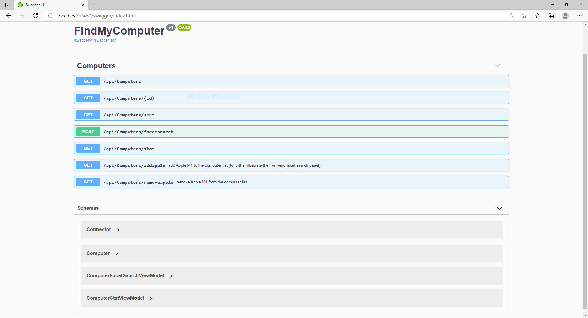

System Environment
===========
- Visual Studio 2019
- .NET 5
- LocalDB

Run Instructions
================
1. Open the project in Visual Studio 2019
2. Build the project (and restore related Nuget package)
3. Run the project with IIS Express (a MSSQL LocalDB should be created at the same time)

Links
=========
API page(for developer): http://localhost:37450/swagger/index.html
UI page (for end-user): http://localhost:37450

Library in used
================
- VueJS 3
- VueRouter
- UIKit
- ASP.NET Core 5.0 Web API
- ef core in .net 5

Note
=========
- For simplicity to get it run, ```<script type="module">``` is used instead of webpack so there is no need for front-end build process.

Screenshots
===============
Main Page

Recommendation View

List View

Recommendation with additional Apple M1 machine

List View with additional Apple M1 machine

Online API by Swagger


